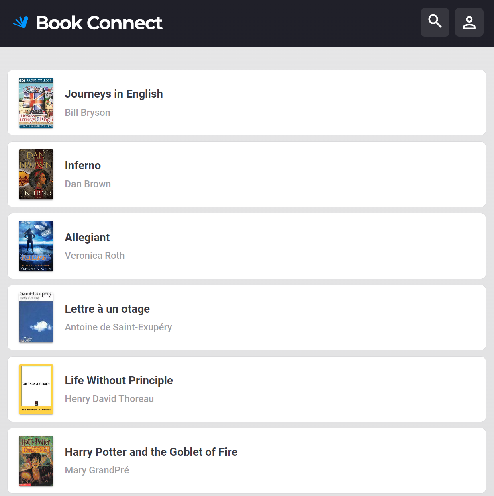

# DJS03 Project Brief: Book Connect - Abstractions

Dive into the delightful world of "Book Connect," where literary adventures await at your fingertips! Browse, explore, and uncover your next great read from a vast, vibrant collection. Whether you're a fan of thrilling mysteries, epic fantasies, or heartwarming romances, "Book Connect" brings the magic of books directly to you. Happy reading! 

The "Book Connect" project provides an opportunity to refine a fully functional version of an application. The focus of this project is to enhance the code's maintainability, extendibility, and readability by applying concepts of objects and functions for abstraction. This will not only streamline future modifications but also consolidate students' understanding of higher-level programming concepts, including documentation, Styleguides, and abstraction principles.

## Goals

- **Book preview feature: it needs it’s own webpage and whenever you want to close the website, you need to go back to the original page.**

## My Tasks

- **Focus** : book preview feature
- **Ensure that the component is self-contained, with its own HTML, CSS, and JavaScript.(NB!!!)(Basically, it needs it’s own webpage and whenever you want to close the website, you need to go back to the original page.)**

#### In Progress:
- I completed all my tasks

